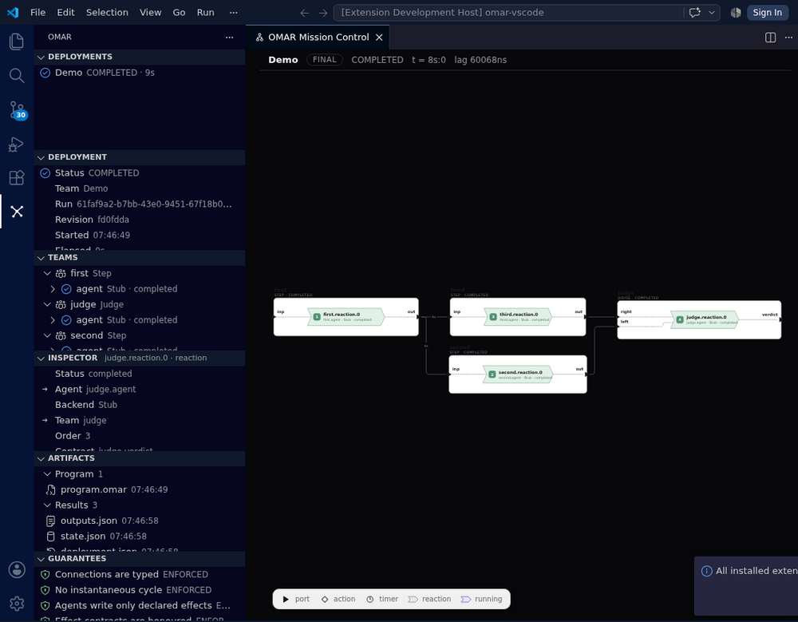

# OMAR for VS Code

Language support and **Mission Control** for the
[OMAR](https://github.com/omar-os/omar) runtime: syntax highlighting,
compilation, and a live, inspectable picture of what a deployment is doing.



## Mission Control

Open the OMAR activity bar with an `omar serve` daemon running and you see
what it is running:

- **Deployments** — every run the daemon has started, its status and elapsed
  time. The newest is selected on its own; a run you start is selected as it
  starts.
- **Deployment** — status, team, revision, timing, the counts, logical time,
  lag, guarantees at a glance, and whether the picture is **LIVE**, **STALE**
  (the event stream broke; what is shown is what was last known) or
  **FINAL**.
- **Mission Control** panel — the topology, drawn by the very component the
  web Mission Control draws it with (vendored from the omar repository and
  bundled into the webview): teams as containers, ports on their boundary,
  reactions as chevrons, timers as clocks, each reaction carrying its state
  as it changes. Pan, zoom, click anything to inspect it.
- **Teams** — instances, their agents, and each agent's reactions with their
  real states.
- **Inspector** — what the runtime knows about the selected thing: a
  reaction's status, agent, triggers and effects with their values; a port's
  value and when it was written; a guarantee's status, mechanism and evidence.
- **Guarantees** — what holds for this run, with the status kept exact:
  **ENFORCED** (the runtime prevents violation), **MONITORED** (it detects and
  reports), **UNCHECKED** (nothing establishes it). Nothing is marked
  **PROVEN**, because nothing is. *Show on topology* brings a guarantee's
  subjects forward.
- **Artifacts** — what the run wrote: the program as submitted, outputs,
  state, each agent's log and instructions. Each opens as an ordinary VS Code
  document.
- **Events** — every event the follower applied, newest first, with notes
  where the stream broke.

Controls are the runtime's own: **Run Program** starts the open `.omar` file
through the daemon (asking for each open input); **Stop** goes through the
`omar` CLI. Pause, resume and approvals are not offered, because
the runtime has no such operation. Nothing is cached across a fetch and
nothing is invented: the extension shows what the runtime says, and says what
it does not know.

### Try it

```bash
# In the omar repository, with omarc built (see its README):
OMARC_BIN=$PWD/lang/.lake/build/bin/omarc omar serve --no-ea
```

Then in VS Code open `examples/Pipeline.omar`, run **OMAR: Run Program**
(input `first.inp` = `1`, real time), and watch the four stages go idle →
running → completed over about eight seconds in the panel, the Teams view
and the status bar. Click a stage to inspect it; open its log under
Artifacts when the run is over.

### Remote SSH

The extension is a workspace extension: under Remote SSH it runs on the
remote host, next to the daemon, and reads the daemon's data directory from
there. Point `omar.runtimeUrl` at the daemon as the remote sees it (the
default, `http://127.0.0.1:7340`, is right when they share a machine) and
artifacts open through VS Code's own remote file access. See
[docs/mission-control.md](docs/mission-control.md) for what the runtime
exposes, what it does not, and how the extension is put together.

## Language support

**Highlights `.omar` files.** Teams and their agents, ports and timers, prompt
triggers and effects, connections and their delays, `main` blocks and the teams
they instantiate. `$(port)` inside a prompt body is marked as the interpolation
it is rather than as more string.

**Compiles with `omarc`.** `OMAR: Compile to bytecode` writes the bytecode
beside the source. On save, the same compile runs to report problems as
diagnostics — the real compiler, so nothing passes here and is refused later.

**Draws the topology of a file.** `OMAR: Show topology diagram` opens a panel
beside the editor showing what the program describes, without running it.
Save and it redraws. With `omar.diagramServerUrl` set it follows that run;
Mission Control's **Follow a Diagram Server** command does the same, read
only, without a daemon.

## Settings

| Setting | Default | |
| --- | --- | --- |
| `omar.runtimeUrl` | `http://127.0.0.1:7340` | Where `omar serve` listens, as the extension host sees it. |
| `omar.dataDir` | `~/.omar` | The runtime's data directory on the extension host; artifacts are read from it. |
| `omar.cliPath` | `omar` | Used to stop a deployment. |
| `omar.compilerPath` | `omarc` | Resolved on `PATH` when it is a bare name. |
| `omar.diagramServerUrl` | *(none)* | e.g. `http://127.0.0.1:7341`, for the per-file diagram. |
| `omar.compileOnSave` | `true` | Report problems as diagnostics on save. |

## Diagnostics are positioned by guessing

`omarc` reports `<path>: <message>` and nothing else — no line, no column. So a
diagnostic's position is recovered from the message: most of them name the thing
they are complaining about in quotes, and that name is looked for in the source.
A qualified name like `flow.topic` is tried by its last segment too, because
that is what the source says inside the team that declares it.

It is a guess. When there is nothing to find, the first line carries the message,
which is at least honest about not knowing. Positions in the compiler's output
would make this exact, and that is where the fix belongs.

## Building it

```bash
git submodule update --init   # the web app's diagram, vendored from omar
npm install
npm run build                 # tsc, then the webview bundle into media/webview/
npm test              # skips the compiler tests when omarc is not built
npm run lint
npm run test:vscode   # a real VS Code against a stub runtime; needs a display or xvfb-run
```

Press <kbd>F5</kbd> in VS Code to launch a window with the extension loaded, and
open `examples/Pipeline.omar`.

The tests that use the real compiler find it at `../omar/lang/.lake/build/bin/omarc`
or wherever `OMARC_BIN` points, and skip themselves when it is not there. CI runs
them in a job of their own, because checking how the compiler's errors are parsed
against strings written here is not the same as checking it against the compiler.
CI also starts a real VS Code under `xvfb` with a stub runtime, and checks
activation, the commands, a picture going live, inspection, artifacts opening,
and a run being started.

## Not yet

- **No language server.** No completion, no go-to-definition, no hover.
- **No proofs.** The guarantee model carries Lean proof evidence scoped to a
  program revision, and marks a proof for another revision stale, but the
  runtime produces none yet.
- **No runtime-published guarantees.** The Guarantees view is a catalogue of
  what the runtime's semantics establish, and says so.
- **No formatter.**
